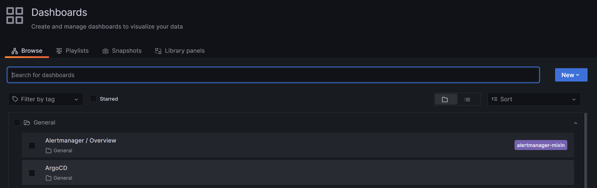
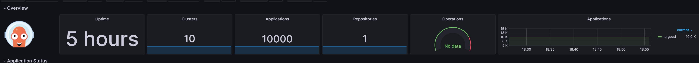
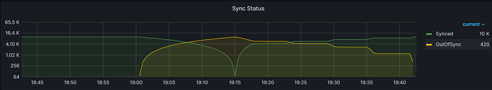
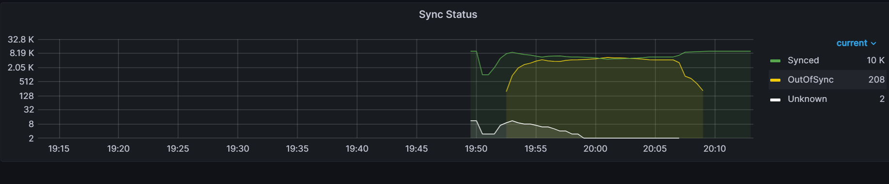

# ArgoCD/ArgoWorkflows Benchmarking on EKS

### Description

The tooling in this repository can be used to perform the following actions:

1. Create n number of EKS clusters with 1 of them being the Control plane cluster and all others being the App clusters. 
    1. The clusters will be named: argotesting#. The Control plane cluster is always argotesting0. 
    2. This process takes roughly 15-20 mins for any number of clusters as the creation process runs in parallel. Most of the work is done by EKS.
2. You can specify the instance type for the Control plane cluster’s nodegroup. The App cluster’s nodegroups are set to utilize m5.large.
3. The Control plane cluster will have the following installed on it:
    1. ArgoCD or ArgoWorkflows
    2. Prometheus/Grafana
    3. aws-load-balancer-controller
4. The following actions are available through the script:
    1. create - create n number of EKS clusters. Can be used to add clusters to an existing fleet. When first ran, the first cluster will be reserved as the Control plane cluster. It will also install Prometheus/Grafana, and the aws-load-balancer-controller into this cluster. 
    2. delete - delete n number of EKS clusters.
    3. installArgo - will install ArgoCD on the Control plane cluster (first cluster).
    4. installArgoWorkflowsNamespace - will install ArgoWorkflows on the Control plane cluster (first cluster) in namespaced mode. 
    5. scaleApps - adding or subtracting the number of apps per app cluster.
    6. scaleAppsRandom - will add apps in a random distribution across all the App clusters.
    7. deleteAllApps - deletes all apps on all app clusters.
    8. scaleArgoCluster - change the number of nodes or the instance type of the ArgoCD cluster.
    9. scaleAppClusters - change the number of nodes on the App clusters.
    10. scaleArgoController - change the number of shards of the ArgoCD Application Controller.
    11. scaleArgoServer - change the number of replicas of the ArgoCD API Server.
    12. scaleArgoRepoServer - change the number of replicas of the ArgoCD Repo Server.
    13. loginArgo - login to ArgoCD.
    14. scalePrometheus - change the number of replicas of the Prometheus server.
    15. setArgoControllerProc - change the number of status/operations processors on the ArgoCD Application Controller.
    16. setArgoControllerQPS - change the QPS/Burst QPS settings on the ArgoCD Application Controller.
    17. setArgoControllerRecTimeout - change the ArgoCD Application Controller resync policy timeout.
    18. setArgoControllerLogLevel - change the ArgoCD Application Controller log level.
    19. setArgoControllerShardAlgorithm - change the ArgoCD Application Controller sharding algorithm.
    20. setWorkflowsQPS - change the QPS/Burst QPS settings on the ArgoWorkflows Controller.
    21. setWorkflowsWorkers - change the number of workers on the ArgoWorkflows Controller.

### Multi-account
Support for multiple AWS accounts are included with the benchmarking tool. Currently there is a 100 cluster per account limit with EKS. To work around this limit, the tool allows you to specific multiple accounts to bring up EKS clusters in.

### Instructions

#### Prerequisites

* aws-cli with proper credentials
* kubectl
* eksctl
* nodejs
* argocd cli client
* AWS account(s)
* A VPC with private subnets for each AWS account(s)
* For multiple AWS accounts, all satellite VPCs must be peered with the main account

#### AWS Account Setup

1. Create n number of AWS accounts.
2. Create AWS IAM users with proper permissions. Generate Access Keys and Secret Keys for each user.
3. Create a VPC with private subnets in each account.
4. If you want to utilize multiple accounts, peer the VPC with the main AWS account which will host the ArgoCD cluster. This is the first account specified in the accounts.json array. You can learn more about peering VPCs with this documentation: https://docs.aws.amazon.com/vpc/latest/peering/working-with-vpc-peering.html. 

#### Script Setup

All EKS clusters will have a prefix of "argotesting". You can change this value in the script by modifying the following variable:

```
const clusterPrefix = "argotesting";
```

In addition, if you are utlizing multiple accounts, you can set the maximum number of clusters per account:

```
const clustersPerAccount = 90;
```

Modify the accounts.json file to add all the accounts you want to work with. Access Keys and Secret Keys are utilized and a corresponding account must be created in each account that has access to perform all the functions required. The accounts.json is an array of Account objects. The first account will house the ArgoCD cluster. See below for an example:

```
[
  {
    "name": "main",
    "awsAccountNum": "<ACCOUNTNUM>",
    "credentials": {
      "accessKeyId": "<ACCESSKEY>",
      "secretAccessKey": "<SECRETKEY>"
    },
    "subnets": ["<PRIVATESUBNET1>", "<PRIVATESUBNET2>"],
    "vpc": "<VPC>",
    "region": "<REGION>"
  },
]
```

#### Example ArgoCD Benchmark

1. Creating a single ArgoCD cluster and a single App cluster

```
node index.js --action create --numClusters 2
```

2. Install ArgoCD, will be installed on argotesting0 cluster. ArgoCD is deployed utilizing a helm chart. You can change default installation values through the argocd_values.yaml. 

```
node index.js --action installArgo
```

3. After installing ArgoCD you will receive URLs and credentials that you can access both ArgoCD and Grafana:

```
...
Running command: kubectl apply -f argocd-metrics.yaml -n argocd
servicemonitor.monitoring.coreos.com/argocd-application-controller-metrics created
servicemonitor.monitoring.coreos.com/argocd-server-metrics created
servicemonitor.monitoring.coreos.com/argocd-repo-server-metrics created
servicemonitor.monitoring.coreos.com/argocd-applicationset-controller-metrics created

ArgoCD URL: https://ad3a0691e78344e0aba6eab3225aa903-1559866324.us-east-1.elb.amazonaws.com
Username: admin
Password: <PASSWORD>
Grafana URL: http://aa2353a183f724c09923523778a053d8-1971769568.us-east-1.elb.amazonaws.com
Username: admin
Password: <PASSWORD>
```

4. You can retrieve these credentials at any time with the following command:

```
node index.js --action getDashboards
```

5. Add some apps to the app cluster(s):
    1. The appName must match the path in the github repo. In this example, my repo is [https://github.com/andklee/argocd-example-apps/](https://github.com/andklee/argocd-example-apps/tree/master/configmap2kb) where you will see a folder for my app: configmap2kb.
    2. I would fork off https://github.com/andklee/argocd-example-apps so that you can make changes to this git repo to trigger application syncs in ArgoCD. 

```
node index.js --action scaleApps --appName configmap2kb --numAppsPerCluster 100 --appRepo https://github.com/andklee/argocd-example-apps
```

6. Or you can add some apps to the app cluster(s) in a random distribution:
    1. The appName must match the path in the github repo. In this example, my repo is [https://github.com/andklee/argocd-example-apps/](https://github.com/andklee/argocd-example-apps/tree/master/configmap2kb) where you will see a folder for my app: configmap2kb.
    2. I would fork off https://github.com/andklee/argocd-example-apps so that you can make changes to this git repo to trigger application syncs in ArgoCD. 
    3. The numApps is the total number of apps you want to create in all the app cluster(s).

```
node index.js --action scaleAppsRandom --appName configmap2kb --numApps 10000 --appRepo https://github.com/andklee/argocd-example-apps
```

7. Open your Grafana dashboard and open the provided ArgoCD dashboard.



8. You can view the ArgoCD dashboard when performing your testing.


9. Now lets add some more clusters. The following command will create 9 more clusters as originally you created 2 already.

```
node index.js --action create --numClusters 11
```

10. Scale the apps across the new clusters. Note I changed the numAppsPerCluster to 1000 and with 10 App clusters I will have a total of 10000 apps. This might take awhile.

```
node index.js --action scaleApps --appName configmap2kb --numAppsPerCluster 1000 --appRepo https://github.com/andklee/argocd-example-apps
```

11. Checking Grafana, you should see 10000 apps.



12. Lets push a git change to the repo. Clone the repo you forked and modify the configmap2kb/configmap.yaml. You can just add or change a few characters in the randomstring key.
13. Commit the change and push it to your repo in Github.
14. You should now see ArgoCD syncing all 10000 apps. You see this from the amount of Out-of-Sync apps and the Workqueue depth:




15. In order to support sharding our ArgoCD application controller, we will change the instance type of our ArgoCD cluster:

```
node index.js --action scaleArgoCluster --instanceType m5.4xlarge --numNodes 1
```

16. Now we will shard the ArgoCD application controller by 10.

```
node index.js --action scaleArgoController --numReplicas 10
```

17. Perform another git change and compare the results in Grafana. With sharding set to 10, we see the sync time drop from 42 mins to 17 mins.



#### ArgoCD Status and Operation Processors

1. You can change the status and operation processors (default is 10 operation processors and 20 status processors) with the following command:

```
node index.js --action setArgoControllerProc --opProc 10 --statProc 20
```

2. At the time of this writing, I did not find how this setting helps/improves performance of sync times and reconciliation queue clearout. 

#### ArgoCD QPS and Burst QPS

1. You can change the QPS and Burst QPS of the k8s client that the ArgoCD Controller utilizes. (default is 50 QPS and 100 Burst QPS) with the following command:

```
node index.js --action setArgoControllerQPS --QPS 50 --burstQPS 100
```

2. This setting helps with both sync times and reconciliation queue clearout. As this increases the QPS/Burst QPS of the client k8s, you should monitor your k8s api-server for any performance issues. 

#### Setting ArgoCD Controller log level

1. You can change the ArgoCD controller log level with this command:

```
node index.js --action setArgoControllerLogLevel --logLevel debug (or info, warn, error)
```

#### Setting ArgoCD Controller Sharding Algorithm (>=ArgoCD 2.8.0)

1. You can change the sharding algorithm utilized by the ArgoCD Controller with the following command:

```
node index.js --action setArgoControllerShardAlgorithm --shardAlgorithm round-robin (or legacy)
```
#### Example ArgoWorkflows Benchmark

1. If you are starting from scratch you can create a single Control plane cluster. Otherwise you can re-use your benchmarking infrastructure deployed for ArgoCD. Just note that ArgoWorkflows will not utilize the App Clusters and you will incurring costs of those App Clusters during your ArgoWorkflows benchmarking.

```
node index.js --action create --numClusters 1
```

2. Install ArgoWorflows, will be installed on argotesting0 cluster. ArgoWorkflows is deployed utilizing plain manifests.

```
node index.js --action installArgoWorkflowsNamespace --numWorkflows 1
```

If you wish to install ArgoWorkflows using sharded namespaces, use the following commands:

```
node index.js --action installArgoWorkflowsNamespace --numWorkflows 5
```

The above command will create 5 instances of ArgoWorkflows in 5 different namespaces named argoworkflows1-5.

3. You can utilize the ArgoWorkflows benchmarking tool to generate workflows for benchmarking. You will need to build the tool first before utilizing it.

4. Build the go dependencies for the `workflows_generator`. 

```
cd workflows_generator
go mod tidy
```

5. Open `workflows_generator/main.go` and modify the following parameters that will determine the workflow generation pattern:

```
numNamespaces := 1
numVUsers := 10
maxWorkflows := 0
creationDelay,err := time.ParseDuration("2000ms")
```  

Set the numNamespaces to the number of namespaces you want to create workflows in.
Set the numVUsers to the number of virtual users that will be generating workflows.
Set the maxWorkflows to the maximum number of workflows you want to generate in total across the virtual users. Setting this number to 0 will mean unlimited workflows.
Set the creationDelay to the time between workflow generation for each virtual user.

The above example will have 10 virtual users generating workflows in the argoworkflows1 namespace, with a creation delay of 2000ms. This comes out to be 5 workflows/second in a single shard/namespace of ArgoWorkflows.

5. After you have configured the generator, you can build it:

```
go build . -o generator
```

6. You can now run the benchmark:

```
./generator
```

#### Argo Workflows Workers

1. You can change the workflow workers (default is 32 workflow-workers) with the following command:

```
node index.js --action setWorkflowsWorkers --numWorkers 64 --numWorkflows 5
```

The above command will set the number of workflow-workers to 64 and will update this setting for 5 ArgoWorkflows controllers in the namespaces argoworkflows1-5.

#### Argo Workflows QPS and Burst QPS

1. You can change the QPS and Burst QPS of the k8s client that the ArgoWorkflows Controller utilizes. (default is 20 QPS and 30 Burst QPS) with the following command:

```
node index.js --action setWorkflowsQPS --QPS 30 --burstQPS 40 --numWorkflows 5
```

#### Unauthorized

1. If you receive an Unauthorized message from EKS, you will need to refresh your AWS credentials:

```
error: You must be logged in to the server (Unauthorized)
```

#### Teardown

1. To delete all the clusters:

```
node index.js --action delete --numClusters 11
```
